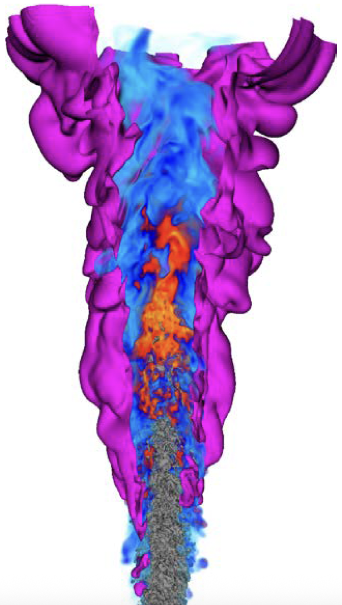
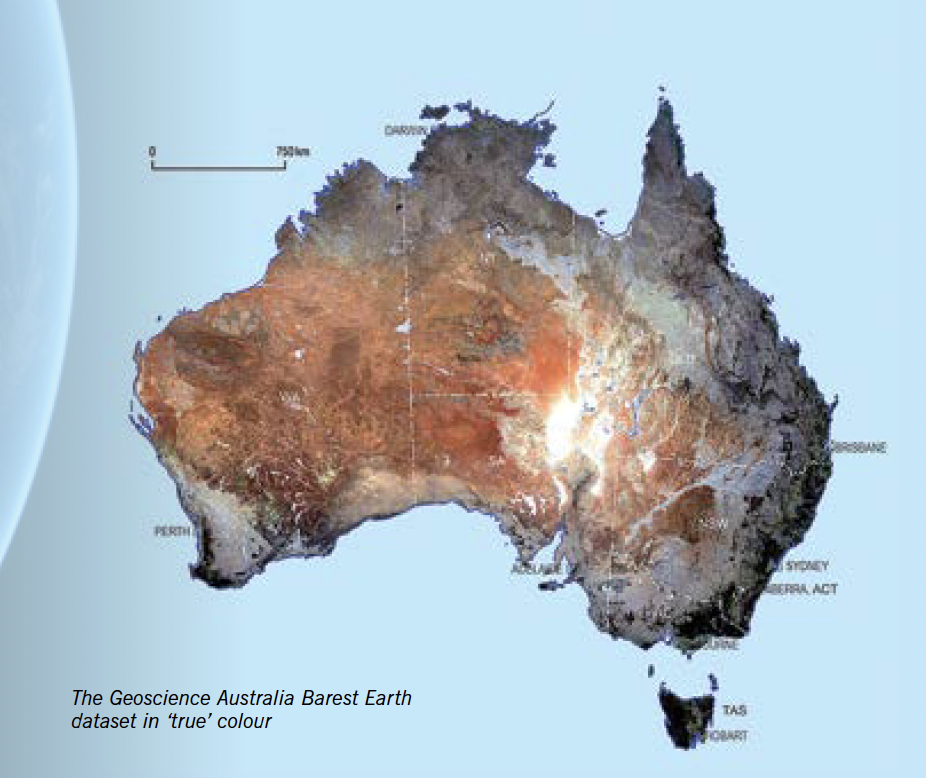
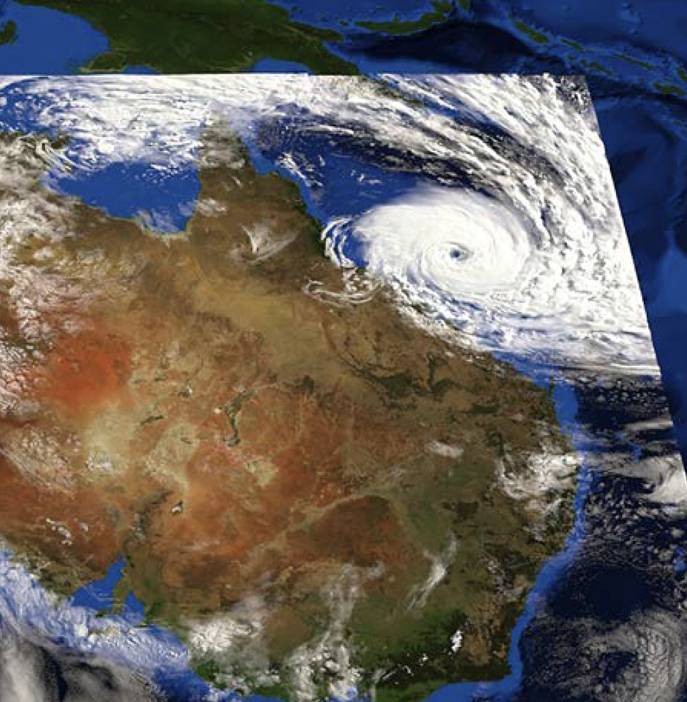
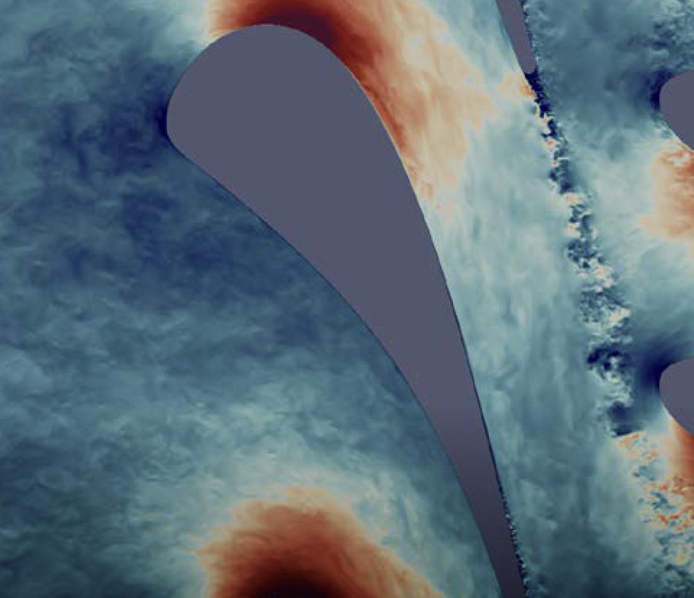

What is High-Performance Computing (HPC)?
--------------------------------------------

High-Performance Computing (HPC) refers to the use of supercomputers and parallel processing techniques to 
solve complex computational problems at high speeds. HPC systems are designed to perform large-scale 
computations that require significant processing power, memory, and storage capabilities. 
They are used in various fields such as scientific research, engineering simulations, financial modeling, 
and data analysis.

A laptop or desktop computer typically has limited processing power and memory
compared to HPC systems. For example, a high-end laptop might have 

* 16 GB of RAM
* 8-core CPU
* GPU with 4 GB of memory

In contrast, an HPC system is much more powerful. for instance, Gadi, the supercomputer at the National 
Computational Infrastructure (NCI) in Australia, has:
* 48 cores per node
* 192 GB of RAM per node
* Four NVIDIA V100 GPUs per node each with 32 GB of memory

.. admonition:: Explanation
   :class: attention

    **Node** refers to a single computing unit within an HPC system. Each node can have multiple CPUs and GPUs 
    and independent memory.

.. image:: ./figs/gadi.jpg
   :width: 600px
   :align: center
   :alt: Gadi Supercomputera at NCI Australia

Moreover, there are many nodes in the system, which can work together to perform computations in parallel.
This allows HPC systems to handle large datasets and perform complex calculations much faster than a typical 
laptop or desktop computer.

When to Use HPC?
^^^^^^^^^^^^^^^^^^^^^^^^^^^^^^^^
HPC is used when the computational requirements of a task exceed the capabilities of standard computing systems.

* When you are dealing with large datasets that does not fit into the memory of a single machine.
* When your application/program is computationally intensive and requires significant processing power.
* When your application is time-sensitive and requires fast execution.

Real-life Examples of HPC
----------------------------

HPC is used in various fields to solve complex problems, simulate real-world scenarios, and analyze 
large datasets. Some exxamples where Gadi, the supercomputer at NCI Australia, is used include:

Bush Fire Simulation
^^^^^^^^^^^^^^^^^^^^^^^^^^^^^^^^

The Bureau of Meteorology, using Gadi, is creating advanced modelling tools that are already enhancing 
authorities' understanding of fire dynamics. Fire agencies now use these models in real time to forecast how 
fires might spread.

Drug Discovery
^^^^^^^^^^^^^^^^^^^^^^^^^^^^^^^^

Drug development companies and universities are simulating protein structures, human cell receptors, and more, 
with a focus on designing new drugs and vaccines. Other research groups, backed by universities, are also 
contributing to this effort.

Genomic Research
^^^^^^^^^^^^^^^^^^^^^^^^^^^^^^^^
.. image:: ./figs/genomic.png
   :width: 600px
   :align: center
   :alt: Genomic researach

Genetic medicine is set to benefit from innovations enabled by NCI and the Gadi supercomputer. The Garvan 
Institute is updating its 4,000-genome Medical Genome Reference Bank, a key comparison set of healthy genomes. 
In 2017, NCI processed 1,000 genomes overnight—a major milestone.

Computational Modeling
^^^^^^^^^^^^^^^^^^^^^^^^^^^^^^^^

Capturing flame behavior in engine conditions with full detail is nearly impossible without computational 
modelling. The most accurate method—Direct Numerical Simulation (DNS)—uses full physical and chemical equations 
to simulate each step, requiring millions of compute hours. Researchers at UNSW run DNS on the Gadi 
supercomputer. Their recent work involved grids with over 1 billion points, 10,000 time steps, 
and 50+ variables, using up to 20,000 processors per simulation.

Satellite Imagery Analysis
^^^^^^^^^^^^^^^^^^^^^^^^^^^^^^^^

ANU and Geoscience Australia reanalysed 30 years of Landsat images to create the Barest Earth map—showing 
Australia with minimal vegetation. Built from petabyte-scale data stored at NCI, the map reveals bare 
soil across the continent and provides a key dataset for future research.

Weather Simulation
^^^^^^^^^^^^^^^^^^^^^^^^^^^^^^^^

The Bureau of Meteorology ran a high-resolution weather model over Australia using a 400-metre grid—spanning 
5,600 km east-west and 4,000 km north-south—with 12.6 billion points. Using the Unified Model on NCI's 
Gadi supercomputer, the simulation took 3 weeks, 12,000 processors, and generated nearly 100 TB of data—setting 
a new scale record for the model.

Airflow Simulation
^^^^^^^^^^^^^^^^^^^^^^^^^^^^^^^^

University of Melbourne is using the Gadi supercomputer to simulate airflow in turbines and generators 
with high precision. The goal is to improve future designs for greater efficiency, lower emissions, and 
longer lifespans.

Climate Modeling
^^^^^^^^^^^^^^^^^^^^^^^^^^^^^^^^

NCI's data environments support large-scale climate analysis using scalable HPC methods and shareable 
Jupyter notebooks. Enhanced search and collaboration tools let researchers efficiently explore CMIP6—the 
Coupled Model Intercomparison Project phase 6, an international collaboration producing standardized 
climate model simulations.

.. admonition:: Key Points
   :class: hint
   
    * HPC systems are designed to perform large-scale computations that require significant processing power, 
      memory, and storage capabilities.
    * HPC is used when the computational requirements of a task exceed the capabilities of standard computing systems.
    * HPC is used in various fields such as scientific research, engineering simulations, financial modeling, and data analysis.
