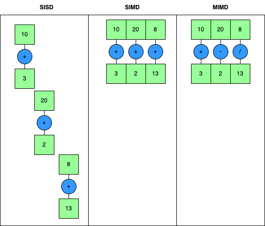

Paralellism in HPC
----------------------------

.. admonition:: Overview
   :class: Overview

    * **Time:** 20 min

    #. Understand the concept of parallelism in High-Performance Computing (HPC).
    #. Learn about different levels of parallelism, including vector parallelism, multi-core parallelism, distributed parallelism, and GPU parallelism.

In this section, we will explore the concept of parallelism in High-Performance Computing (HPC). Parallelism 
is the ability to perform multiple computations simultaneously, which is essential for achieving high performance 
in HPC applications. Parallelism can be achieved through various means, including the use of multiple threads, 
processes, and distributed systems.

You will hear the word ``concurrency`` and ``parallelism`` used interchangeably, but they are not the same. 
Concurrency refers to the ability of a system to handle multiple tasks at once, but not necessarily 
simultaneously. Parallelism, on the other hand, refers to the simultaneous execution of multiple tasks. 

.. important::

    All parallel tasks are concurrent, but not all concurrent tasks are parallel.

Threads and Processes
^^^^^^^^^^^^^^^^^^^^^^^^^^^^^^^^

In parallel computing, a ``thread`` is the smallest unit of processing that can be scheduled by an operating system.
A ``process`` is a program in execution, which can contain multiple threads. Threads within a process share the 
same memory space, allowing for efficient communication and data sharing.

``Threads`` are lightweight compared to ``processes``, as they share the same memory space and resources of the parent 
``process``. This allows for faster context switching and communication between ``threads``. ``Processes``, on the other 
hand, are independent entities with their own memory space. 

.. list-table:: Difference Between Process and Thread
   :widths: 25 35 40
   :header-rows: 1

   * - Feature
     - Process
     - Thread
   * - Definition
     - Independent program with its own memory space and resources.
     - Lightweight unit of execution within a process.
   * - Memory
     - Has separate memory space.
     - Shares memory space with other threads in the same process.
   * - Communication
     - Uses Inter-Process Communication (IPC), which is slower.
     - Communicates through shared memory, which is faster.
   * - Overhead
     - Higher overhead due to resource duplication.
     - Lower overhead since resources are shared.
   * - Isolation
     - Fully isolated from other processes.
     - Not isolated; one thread can affect others in the same process.
   * - Creation Time
     - Slower to create and manage.
     - Faster and more efficient to create.
   * - Context Switching
     - More expensive due to isolated memory.
     - Cheaper since threads share the same address space.

.. admonition:: Explanation
   :class: attention

    * Context switching is a process where the CPU switches from one thread or process to another.
    * This involves saving the state of the current thread or process and loading the state of the next one.
    * Context switching is more efficient for threads than processes because threadsthreads share the same memory space, allowing for faster access to shared data and resources.
    * Context switching allows OS to have more threads than CPU cores, enabling better resource utilization.

There are different levels of parallelism in HPC, including:

1. ``Vector Parallelism``: This involves performing the same operation on multiple data points simultaneously. It is often used in vector processors and SIMD (Single Instruction, Multiple Data) architectures.
2. ``Multi-core Parallelism``: This type of parallelism utilizes multiple cores within a single processor to execute different threads or processes concurrently. Each core can handle its own thread, allowing for efficient multitasking.
3. ``Distributed Parallelism``: This involves spreading tasks across multiple machines or nodes in a cluster. Each node works on a portion of the task, and they communicate to share results.
4. ``GPU Parallelism``: Graphics Processing Units (GPUs) are designed to handle parallel tasks efficiently. They can execute thousands of threads simultaneously, making them ideal for tasks like image processing, machine learning, and scientific simulations.

Vector Parallelism
^^^^^^^^^^^^^^^^^^^^^^^^^^^^^^^^

Vector parallelism is a type of parallel computing where the same operation is applied to multiple data 
points simultaneously. This is often achieved using SIMD (Single Instruction, Multiple Data) instructions.

SIMD allow a single instruction to operate on multiple data elements at once.

.. image:: ./figs/vector.png
   :width: 600px
   :align: center
   :alt: Vector Parallelism

Multi-core Parallelism
^^^^^^^^^^^^^^^^^^^^^^^^^^^^^^^^

Multi-core parallelism involves using multiple cores within a single processor to execute different threads or 
processes concurrently. Each core can handle its own thread, allowing for efficient multitasking.

.. image:: ./figs/multicore.png
   :width: 600px
   :align: center
   :alt: Multi-core Parallelism

Distributed Parallelism
^^^^^^^^^^^^^^^^^^^^^^^^^^^^^^^^

Distributed parallelism involves spreading tasks across multiple machines or nodes in a cluster. Each node works 
on a portion of the task, and they communicate to share results.

.. image:: ./figs/multinode.png
   :width: 600px
   :align: center
   :alt: Distributed Parallelism

GPU Parallelism
^^^^^^^^^^^^^^^^^^^^^^^^^^^^^^^^

Graphics Processing Units (GPUs) are designed to handle parallel tasks efficiently. They can execute thousands 
of threads simultaneously, making them ideal for tasks like image processing, machine learning, and 
scientific simulations.

.. image:: ./figs/SM.png
   :width: 600px
   :align: center
   :alt: GPU Parallelism

.. admonition:: Key Points
   :class: hint

    1. Parallelism is the ability to perform multiple computations simultaneously.
    2. Threads are lightweight units of execution within a process, while processes are independent programs.
    3. Different levels of parallelism include vector parallelism, multi-core parallelism, distributed parallelism, and GPU parallelism.
    4. Understanding these concepts is essential for designing efficient HPC applications.